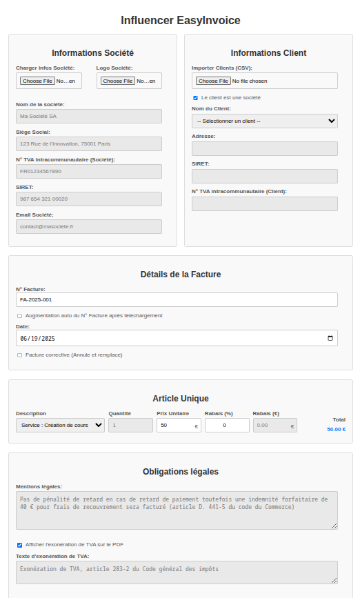

# 🌟 Influencer EasyInvoice 🌟

 

## Table des matières
1.  [À propos](#-à-propos)
2.  [Fonctionnalités](#-fonctionnalités)
3.  [Comment utiliser](#-comment-utiliser)
4.  [Installation locale](#-installation-locale)
5.  [Structure du projet](#-structure-du-projet)
6.  [Technologies utilisées](#technologies-utilisees)
7.  [Licence](#-Licence)
8.  [Note Importante](#note-importante)

---


## 💡 À propos

**Influencer EasyInvoice** est une application web simple et intuitive conçue pour aider les influenceurs, les freelancers et les petites entreprises à gérer et générer facilement leurs factures. Fini les tracas des tableurs complexes ou des logiciels onéreux ! Avec EasyInvoice, vous pouvez créer, prévisualiser, télécharger et même importer/exporter vos factures en un clin d'œil.

Conçue pour la simplicité et l'efficacité, l'application est entièrement basée sur le navigateur, ce qui signifie aucune installation complexe de base de données ou de serveur : juste ouvrez le fichier HTML et c'est parti !

## ✨ Fonctionnalités

* **Génération de factures PDF :** Créez des factures professionnelles au format PDF, prêtes à être envoyées à vos clients.
* **Calculs automatiques :** Calcul du Total HT, de la TVA (avec options de taux multiples : 0%, 5%, 10%, 20%) et du Total TTC en temps réel.
* **Gestion des informations :**
    * Informations de votre société (nom, adresse, SIRET, TVA intracommunautaire, email).
    * Informations client (nom, adresse, SIRET/TVA intracommunautaire pour les entreprises, téléphone/email pour les particuliers).
* **Articles de facture personnalisables :** Ajoutez une description, une quantité, un prix unitaire et un pourcentage de remise pour chaque article.
* **Sauvegarde locale :** Toutes vos données (informations société, clients, articles, etc.) sont sauvegardées automatiquement dans le stockage local de votre navigateur pour un accès rapide et persistant.
* **Import/Export CSV :**
    * Importez/Exportez les informations de votre société.
    * Importez/Exportez des listes de clients prédéfinies.
    * Importez/Exportez des factures complètes (articles, totaux, mentions, etc.) via des fichiers CSV pour un partage facile ou une archivage.
* **Prévisualisation en temps réel :** Visualisez le rendu de votre facture PDF directement dans l'application avant de la télécharger.
* **Mentions légales personnalisables :** Ajoutez des mentions légales ou des notes spécifiques à vos factures, avec une option d'exonération de TVA.
* **Gestion des numéros de facture :** Option d'incrémentation automatique et gestion des factures correctives.

## 🚀 Comment utiliser

1.  **Ouvrez l'application :** Il suffit d'ouvrir le fichier `easyInvoice.html` dans votre navigateur web préféré (Chrome, Firefox, Edge, Safari, etc.).
2.  **Remplissez les informations :** Saisissez les détails de votre société, les informations de votre client et les articles de la facture. Les calculs se mettent à jour automatiquement.
3.  **Sélectionnez le taux de TVA :** Choisissez le taux de TVA applicable dans le menu déroulant.
4.  **Prévisualisez :** Cliquez sur le bouton "Prévisualiser le PDF" pour voir à quoi ressemblera votre facture.
5.  **Téléchargez :** Cliquez sur "Télécharger le PDF" pour enregistrer la facture sur votre ordinateur.
6.  **Sauvegarde & Import/Export :** Utilisez les options "Exporter" et "Importer" pour sauvegarder et charger vos données de facture via CSV.

## 💻 Installation locale

Pour faire fonctionner Influencer EasyInvoice sur votre machine locale :

1.  **Clonez le dépôt :**
    ```bash
    git clone https://github.com/theroboticien/easyInvoice.git
    ```

2.  **Accédez au répertoire du projet :**
    ```bash
    cd easyinvoice
    ```

3.  **Ouvrez le fichier HTML :**
    Ouvrez simplement le fichier `easyInvoice.html` dans votre navigateur web.

L'application est entièrement autonome et s'exécute côté client, il n'y a pas de dépendances serveur à installer !


## 🛠️ Technologies utilisées

* **HTML5**
* **CSS3**
* **JavaScript (ES6+)**
* **jsPDF** : Une bibliothèque JavaScript pour générer des PDFs côté client.
* **jsPDF-AutoTable** : Un plugin pour jsPDF facilitant la création de tableaux dans les PDFs.

## 📄 Licence

Ce projet est sous licence MIT. Voir le fichier [LICENSE](LICENSE) pour plus de détails. 

## Note importante

Ce projet a été principalement développé en adoptant une approche de "vibe coding", privilégiant l'intuition et l'expérimentation rapide pour donner vie aux fonctionnalités, en utilisant principalement des LLMs.
L'idée c'est de créé une application complete aussi simplictique quel est afin de voir et comprendre l'interet de ces outils, et de partager le code avec d'autre personne qui peuvent etre interessé de voir le resultat

